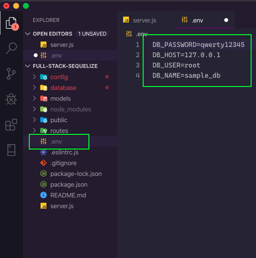
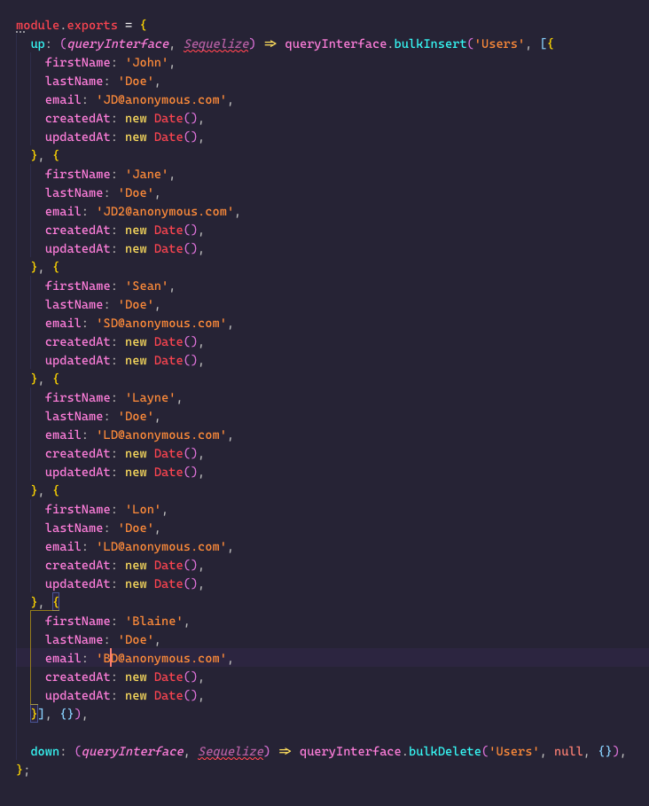
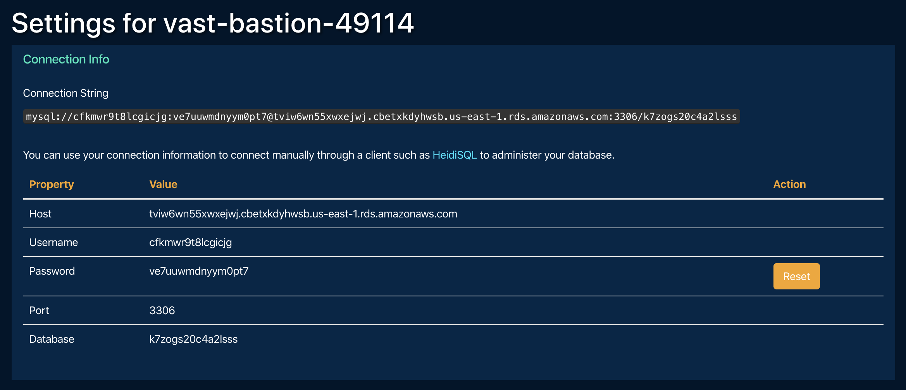
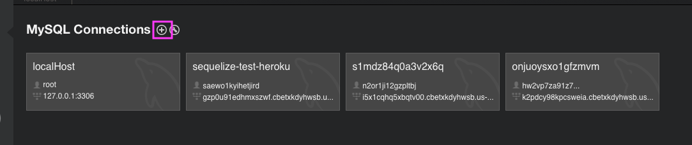
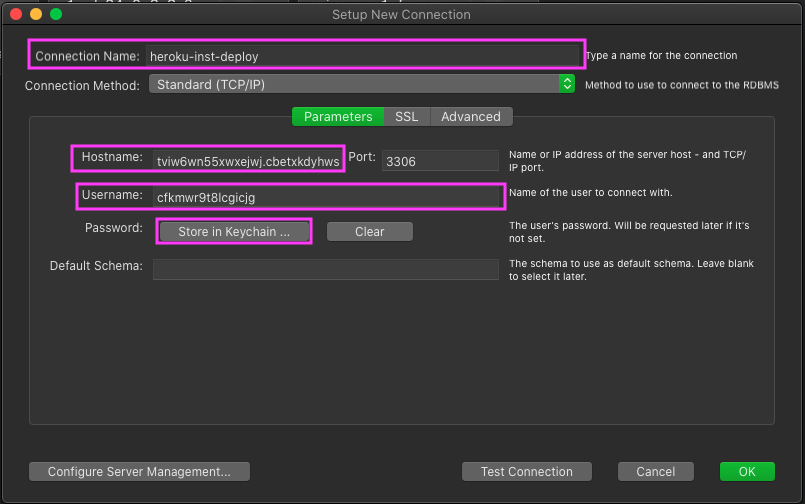
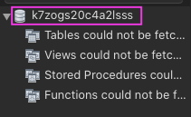

# **Full-Stack Sequelize Template**
this template is meant to get you up-and-running with a full-stack web application scaffolded out and ready to run using node, express, and sequelize.  happy coding.

### **Useful Features**
* 'dotenv' environmental variables package configured for sequelize
* nodemon package configured
* ESlint package configured for Airbnb styleguide

### **How to Use This Template**
* click "use template" next to the clone button, this will create a new repository on *your* github account
* clone the repository down to your machine
* run the `schema.sql` query in the mySQL tool of your choice  
* run &nbsp; `npm install`
* run &nbsp; `touch .env` &nbsp;in the root of your repository
* open the .env file
* add the four environmental variables that will be used to connect to the database:
            `DB_PASSWORD=yourpassword`
            `DB_HOST=127.0.0.1`
            `DB_USER=root`
            `DB_NAME=sample_db`
* run &nbsp; `npm start` to start the server with nodemon which will automatically refresh after any server-side code changes
* check out the optional migrations guide below!
* check out the heroku deployment guide below!

### **Optional Database Migrations and Seeding**
* Sequelize-cli allows you to create models and seed your database from the command line
* This will allow you to pre-fill your database for development, as well as provide a consistent data set for testing accross multiple collaborators
* Please refer to the instructions below and [Sequelize migrations documentation](https://sequelize.org/master/manual/migrations.html#bootstrapping) to configure this project for migrations
* to fully take advantage of this feature, it makes sense to use the cli tools to create the basic shell of your models, as this will also create a migration file at the same time.
* to create a model run `npx sequelize-cli model:generate

### **Optional Instructions for Implementing Migrations**
* run two sequelize-cli commands to initialize the migrations and seeders folders

        npx sequelize-cli init:migrations

  and 

        npx sequelize-cli init:seeders

* run 

        npx sequelize-cli model:generate --name <ModelName> --attributes,<someAttribute>:string,<anotherAttribute>:boolean

    entering in the model name and the attribute you are initializing it with - for example: 

        npx sequelize-cli model:generate --name User --attributes firstName:string,lastName:string,email:string

* this will create the model in the models folder, and a migration file in the migrations folder.
* you will need to go to the model file and finish setting it up, add validation, etc.
* Once you have set up your model, you can run the migration to create the table in your database:
            
        npx sequelize-cli db:migrate

* Next we will create a seed file that will allow us to populate the table with a dataset on command, allowing us to share a consistent dataset accross collaborators, as well as revert the table back to a clean state after testing.

        npx sequelize-cli seed:generate

* Open the seed file created in the seeders folder and set up your seed data. for example:

* once you have filled in your seed file you can run it:

        npx sequelize-cli db:seed:all

* you are now all set to push everything up to github and continue with the steps below to deploy to heroku.
* the final step will be to seed your production database as well.  See the optional last step in the heroku deployment section.

### **Heroku Deployment**
* you nay need to log into the heroku cli, do so by running &nbsp; `heroku login` &nbsp; in the terminal, you will also need the heroku website so might as well log in there too
* run &nbsp;`heroku create`
* select your application on the heroku website
* click "Configure Add-ons"
* type "JawsDB" into the search bar, select "JawsDB MySQL" and provision the "Kitefin Shared - Free" default option
* open the JawsDB instance you have created by clicking on it
* you will be brought to a page with the connection information for your deployed database, which you will need to establish a connection to your production database in the MySQL management tool of your choice

* now it is time to create an instance of your production database in your MySQL management tool.  The following instructions are specifically for MySQL Workbench, but they should apply in a general sense to any tool you are using.
* create a new MySQL connection instance

* give your connection a meaningful name, then using the information from the JawsDB Connection Info page, fill in the connection information on the new connection dialog, click the "store in keychain" button and store your password

* test you connection by clicking the "Test Connection" button at the bottom of the dialog
* if your connection fails, double check that you copied the information correctly
* if your connection succeeds, click into the instance
* don't be alarmed if your schemas panel looks like this, you will still be able to view and query the database: 

* to run queries, dont forget your `USE <DATABASE NAME>;` statement, using the database name you see in the schemas panel:

* now you can manage your deployed production database!
* ***Optional last steps when using migrations:***
* To seed your production database, add the following line to the scripts in the &nbsp; `package.json` &nbsp; file, right below the start script:

        "heroku-postbuild": "npx sequelize-cli db:migrate && npx sequelize-cli db:seed:all"

* save and commit your changes to github, then run another

        git push heroku master

    to push the changes to heroku and run a fresh build.  The script that was added will run the migration and seed at the end of the heroku build.
* `select * ...` &nbsp; within your database management tool to see your freshly seeded production database!  Note that the database will be re-seeded each time you run a build, and the build ***does not*** drop the table automatically.  So to avoid doubling your data set, drop the table prior to running another build (you can use your management tool for this).  If you do not wish to continue re-seeding your production database, as you surely will at some point, just remove the `"heroku-postbuild"` script from the `package.json` file.

### **Notes About This Database Configuration**
* you now have two databases, a local development database and a deployed production database
* when running your application locally as you develop, it will connect to the local development database using the credentials you supplied in your .env file
* the heroku-deployed application will connect automatically to the deployed production database

### **To Disable ESLint**
* delete the .eslintrc.js file
* run &nbsp; `npm uninstall eslint`

### **Links and Resources**
* [eslint Getting started page](https://eslint.org/docs/user-guide/getting-started)
* [dotenv NPM Documentation](https://www.npmjs.com/package/dotenv)
* [airbnb styleguide documentation](https://github.com/airbnb/javascript)
